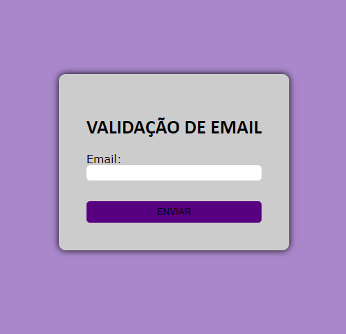

# Validações
###  Neste projeto, aprendemos a utilizar JavaScript e desenvolvemos dois sistemas de validação: um para e-mails e outro para CPF.

## Explicação do CPF js:

### ``Adiciona um Escutador ao Formulário``

    document.getElementById('CPFform').addEventListener('submit', function (event) {

        event.preventDefault();
        const CPF = document.getElementById('CPF').value;
        const msg = document.getElementById('message');
 
        if (validarCPF(CPF)) {
            msg.textContent = "O CPF é válido!";
            msg.style.color = 'green';
        } else {
                msg.textContent = "O CPF é inválido!";
        msg.style.color = 'red';
        }
    });

### Explicação:

* document.getElementById('CPFform'): Seleciona o formulário com o ID CPFform.

* .addEventListener('submit', function (event) { ... }): Adiciona um escutador de eventos que aguarda o evento de submissão do formulário.

* event.preventDefault(): Impede o comportamento padrão de envio do formulário, que recarregaria a página.

* const CPF = document.getElementById('CPF').value: Obtém o valor do campo de entrada com o ID CPF.

* const msg = document.getElementById('message'): Obtém o elemento com o ID message, onde a mensagem de validação será exibida.

* if (validarCPF(CPF)) { ... } else { ... }: Verifica se o CPF é válido chamando a função validarCPF(CPF).

* Se for válido, a mensagem é definida como "O CPF é válido!" com a cor verde.

* Se não for válido, a mensagem é definida como "O CPF é inválido!" com a cor vermelha.

### ``Função de Validação de CPF``

    function validarCPF(CPF) {
        CPF = CPF.replace(/[^\d]+/g, ''); // Remove caracteres não numéricos
 
    // Verificar se o valor informado contem 11 dígitos e se todos os dígitos são iguais
        if (CPF.length !== 11 || /^(\d)\1{10}$/.test(CPF)) {
            return false;
        }
 
        let soma = 0;
        let resto;
 
    // Validação do primeiro dígito verificador

        for (let i = 1; i <= 9; i++) {
            soma += parseInt(CPF.substring(i - 1, i)) * (11 - i);
        }
 
        resto = (soma * 10) % 11;
        if ((resto === 10) || (resto === 11)) {
            resto = 0;
        }
        if (resto !== parseInt(CPF.substring(9, 10))) {
        return false;
        }
        soma = 0;
 
    // Validar o 11º dígito do CPF - 2º dígito verificador

        for (let i = 1; i <= 10; i++) {
            soma += parseInt(CPF.substring(i - 1, i)) * (12 - i);
        }
 
        resto = (soma * 10) % 11;
        if ((resto === 10) || (resto === 11)) {
            resto = 0;
        }
        if (resto !== parseInt(CPF.substring(10, 11))) {
            return false;
        }
        return true;
    }

### Explicação:

* Remover Caracteres Não Numéricos:
CPF = CPF.replace(/[^\d]+/g, ''); 
Usa uma expressão regular para remover todos os caracteres não numéricos do CPF.

* Verificar Comprimento e Sequência Repetitiva:
Verifica se o CPF tem exatamente 11 dígitos e se não é uma sequência repetitiva (como 11111111111).

* Validação do Primeiro Dígito Verificador:
    let soma = 0;
    for (let i = 1; i <= 9; i++) {
        soma += parseInt(CPF.substring(i - 1, i)) * (11 - i);
    }

    resto = (soma * 10) % 11;
    if ((resto === 10) || (resto === 11)) {
        resto = 0;
    }
    if (resto !== parseInt(CPF.substring(9, 10))) {
        return false;
    }

* Calcula a soma dos primeiros 9 dígitos do CPF multiplicados por pesos específicos.

* Calcula o primeiro dígito verificador e o compara com o 10º dígito do CPF.

### ``Validação do Segundo Dígito Verificador:``

    soma = 0;
    for (let i = 1; i <= 10; i++) {
        soma += parseInt(CPF.substring(i - 1, i)) * (12 - i);
    }

    resto = (soma * 10) % 11;
    if ((resto === 10) || (resto === 11)) {
        resto = 0;
    }
    if (resto !== parseInt(CPF.substring(10, 11))) {
        return false;
    }

* Calcula a soma dos primeiros 10 dígitos do CPF (incluindo o primeiro dígito verificador) multiplicados por outros pesos.

* Calcula o segundo dígito verificador e o compara com o 11º dígito do CPF.

### ``Retorno do Resultado:``
    
    return true;

* Se ambos os dígitos verificadores forem válidos, a função retorna true. Caso contrário, retorna false.

 
### CPF IMAGEM

 
#

## Explicação do email js:
 
### ``Função checarEmail:``

    function checarEmail(){
    if(document.forms[0].email.value == "" || document.forms[0].email.value.indexOf('@') == -1 || document.forms[0].email.value.indexOf('.') == -1)
    {

* Essa função tem o objetivo de verificar o e-mail informado no formulário é válido.

### ``Mensagem de erro e retorno:``

    alert("Por favor, informe um email válido"); return false;

* Exibe um alerta com a mensagem de erro e retorna false, o que pode impedir o envio do formulário ou a execução de outras ações dependentes desta função.
 
### ``Mensagem de sucesso e atualização do HTML:``

    alert("Email informado com sucesso!");
    document.getElementById('email').innerHTML = document.forms[0].email.value;

* Se o e-mail for válido, exibe uma mensagem de sucesso.
* Atualiza o conteúdo do elemento com id='email' para mostrar o e-mail informado.
 
### ``Função verifica``

    Essa função é usada para verificar se o e-mail foi informado.
    if(document.forms[0].email.value == 0 ){

* Aqui, há um problema: document.forms[0].email.value é uma string e não pode ser igual a 0. Para verificar se o campo está vazio, o correto seria document.forms[0].email.value == "".
 
### ``Mensagem de alerta e foco:``
 
    alert("por favor, informe seu E-mail");
    document.frmEnvia.email.focus();

* Exibe um alerta pedindo para o usuário informar o e-mail.
Define o foco no campo de e-mail (document.frmEnvia.email.focus();). Note que document.frmEnvia deve ser substituído por document.forms[0], que é mais consistente com o código anterior.
 
### ``Retorno:``
    return false;
* Retorna false para indicar que a verificação falhou.
 
### ``Retorno padrão:``

    return true;
* Se o campo de e-mail não estiver vazio, a função retorna true, indicando que a verificação foi bem-sucedida.

### EMAIL IMAGEM

